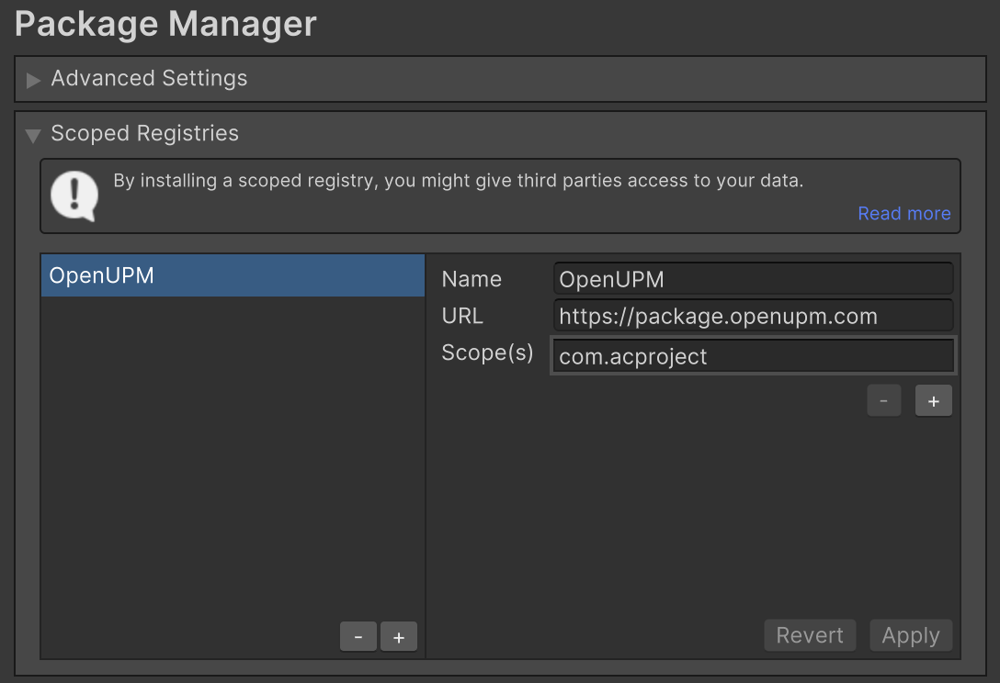
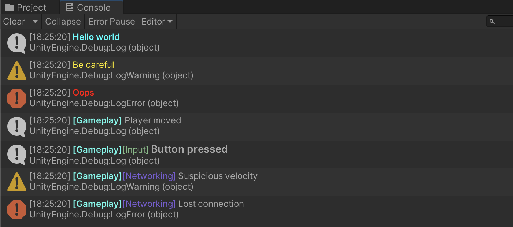

# PrettyLog

[](https://openupm.com/packages/com.acproject.prettylog/)

PrettyLog is a small, editor-focused logging helper for Unity that formats Unity Console output with colored, sized and optionally bold tags to make debugging information more readable.

Key features
- Colored channel tags and optional sub-channel tags
- Channel and sub-channel registration APIs
- Per-channel and per-subchannel muting
- Log verbosity filtering (ffmpeg-style log level filtering) for channels and sub-channels
- Convenience static facades for quick colored logs (`PrettyQuickLog`) and structured channel-based logs (`PrettyLog`)

# Installing

## Via Unity Package Manager and OpenUPM

### Terminal:

```bash
openupm add com.acproject.prettylog
```

### Manual

Open your Unity project settings
- Add the OpenUPM package registry:
    - Name: OpenUPM
    - URL: https://package.openupm.com
    - Scope(s): com.acproject.prettylog
- Open the Unity Package Manager window
- Change the Registry from Unity to My Registries
- Add the PrettyLog package



## Via Unity Package Manager and Git url

- Open your Unity Package Manager
- Add package from git url: https://github.com/Aleclock/com.acproject.prettylog#upm

# How to use it

## Quick colored log

```csharp
PrettyQuickLog.Log("Hello world", Color.cyan, isBold: true);
PrettyQuickLog.LogWarning("Be careful", Color.yellow);
PrettyQuickLog.LogError("Oops", Color.red, isBold: true);
```

## Channel-based logging (recommended for organized projects):

```csharp
// Register a channel (recommended at startup)
PrettyLog.RegisterChannel("Gameplay", Color.green);

// Register a sub-channel with custom styling
PrettyLog.RegisterSubChannel("Gameplay", "Input", "#7DBA84", isBold: true, fontSize: 14);
PrettyLog.RegisterSubChannel("Gameplay", "Networking", "#795dd6");

// Log channel-level
PrettyLog.Log("Gameplay", "Player moved");

// Log sub-channel-level
PrettyLog.Log("Gameplay", "Input", "Button pressed");
PrettyLog.LogWarning("Gameplay", "Networking", "Suspicious velocity");
PrettyLog.LogError("Gameplay", "Networking", "Lost connection");
```

## Personalized logging with custom styling

```csharp
PrettyLog.Log(SCRIPT_CHANNEL, $"Player health: {"75".Bold().Color("#ff00ff")}");
```

## Resulting Console



## Muting channels and sub-channels

```csharp
PrettyLog.SetChannelMute("Gameplay", true);
PrettyLog.SetSubChannelMute("Gameplay", "Input", true);
```

## Log Verbosity (Log levels)

You can specify a verbosity limit for channels and sub-channels. When logging a message, you can define its verbosity. If a log's verbosity is greater than the target channel/sub-channel's threshold, the log is ignored.

### Verbosity levels

`LogVerbosity` defines the following levels:
- `Silent` (0) - Logs nothing
- `Error` (1) - Logs only errors
- `Warning` (2) - Logs warnings and errors
- `Info` (3) - Logs info, warnings, and errors (Default for standard logs)
- `Verbose` (4) - Logs detailed logs, info, warnings, and errors
- `Debug` (5) - Logs everything (Default threshold for newly registered channels)

### Examples

```csharp
// Register a channel with Warning limit (Info/Verbose/Debug will be ignored)
PrettyLog.RegisterChannel("Physics", Color.red, isBold: true, LogVerbosity.Warning);

// This will log (Error <= Warning)
PrettyLog.LogError("Physics", "Gravity failure!");

// This will be ignored (Info > Warning)
PrettyLog.Log("Physics", "System initialized.");

// Sub-channels inherit the main channel's limit unless overridden
PrettyLog.RegisterSubChannel("Physics", "Collisions", customColor: null, isBold: false, fontSize: 12, LogVerbosity.Verbose);

// This will log since the sub-channel explicitly overrides the limit to Verbose
PrettyLog.Log("Physics", "Collisions", "Collision detected.", LogVerbosity.Verbose);
```

### Changing verbosity at runtime

You can change verbosity thresholds dynamically at runtime:
```csharp
PrettyLog.SetChannelVerbosity("Gameplay", LogVerbosity.Verbose);
PrettyLog.SetSubChannelVerbosity("Gameplay", "Input", LogVerbosity.Debug);
```

# Contributing

Contributions, issues and suggestions are welcome, please open a PR or an issue.

# License

This project is distributed under the terms of the included `LICENSE` file.

# Changelog

See `CHANGELOG.md` for details.

<br>

---

<br>

This README was generated by Copilot.